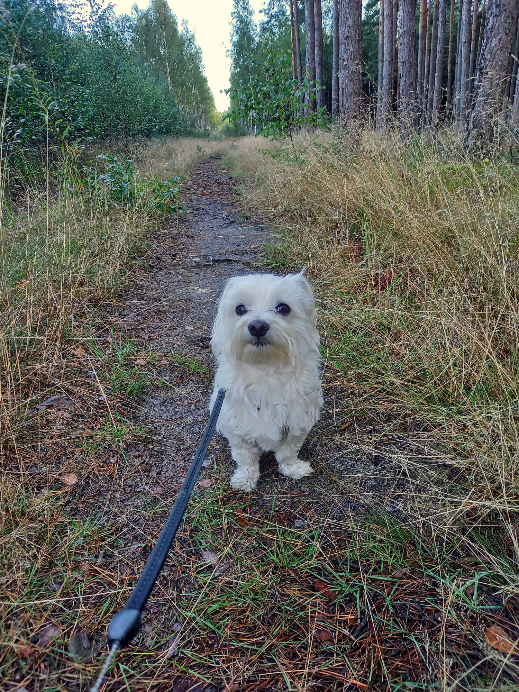
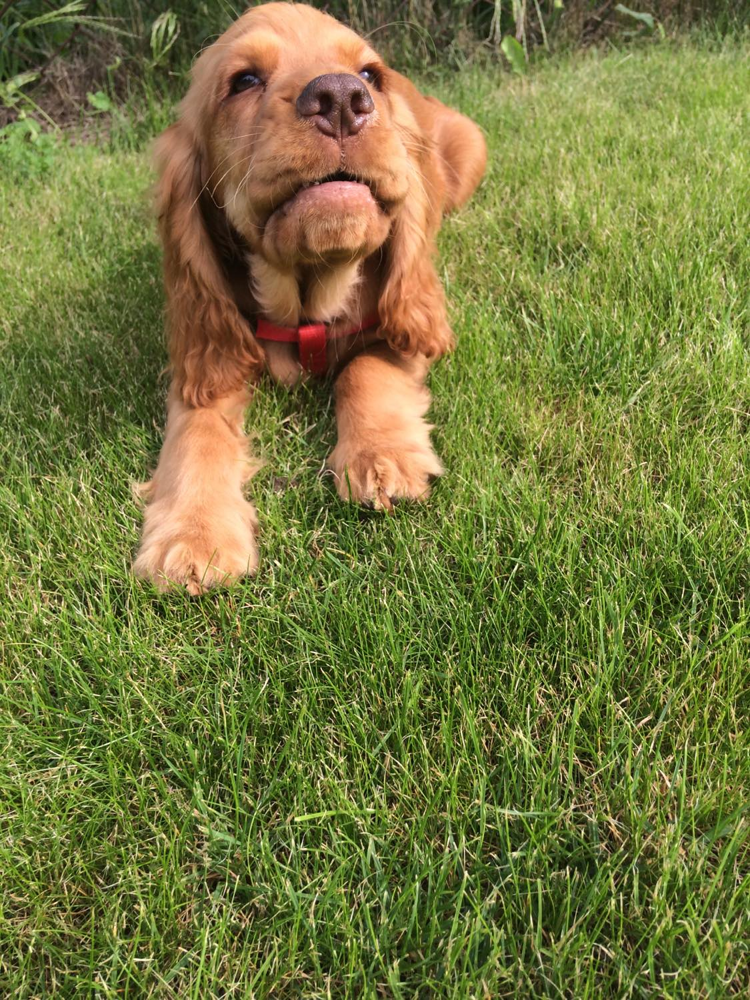

# Doggo Share

<p float="left">
  
  
</p>

Doggo Share is a cloud application that allows you to share your dog pictures with the world. It is built using Azure Functions, Azure Storage and Azure Cognitive Services.
Register on the website using an email to receive all future dog photos. Upload your picture on the website and it will be automatically analyzed by Azure Cognitive Services to determine whether there is a dog in the picture or not. The picture will be stored in Azure Storage and if there is a dog in the picture, a link to the picture will be sent to all registered users. Additionally, on the website you can see all the pictures that were uploaded by other users along with the dog detection results and a link to the picture.

## Project Initialization

### Login to Azure
```bash
az login
```

### Download dependencies
```bash
(cd ui; npm install)
```

```bash
(cd code; npm install)
```

### Initialize Terraform
```bash
(cd infra; terraform init)
```

## Deployment

### Create infrastructure
```bash
(cd infra; terraform apply)
```

### Get SAS token
```bash
(cd infra; terraform output -json)
```

### Replace SAS token in code ("sasToken" variable in "ui/index.js")
```bash
vim ui/index.js
```

### Build website
```bash
(cd ui; npm start)
```

### Upload website to Azure Storage
Go to doggosharecodesa storage account in Azure. Click on "Static website" and enable it. Set index document name to "index.html" and error document path to "index.html". Click "Save". Click on "Browse" and upload the files from "ui/dist" folder.

### Publish cloud functions
```bash
(cd code; func azure functionapp publish doggo-share)
```

