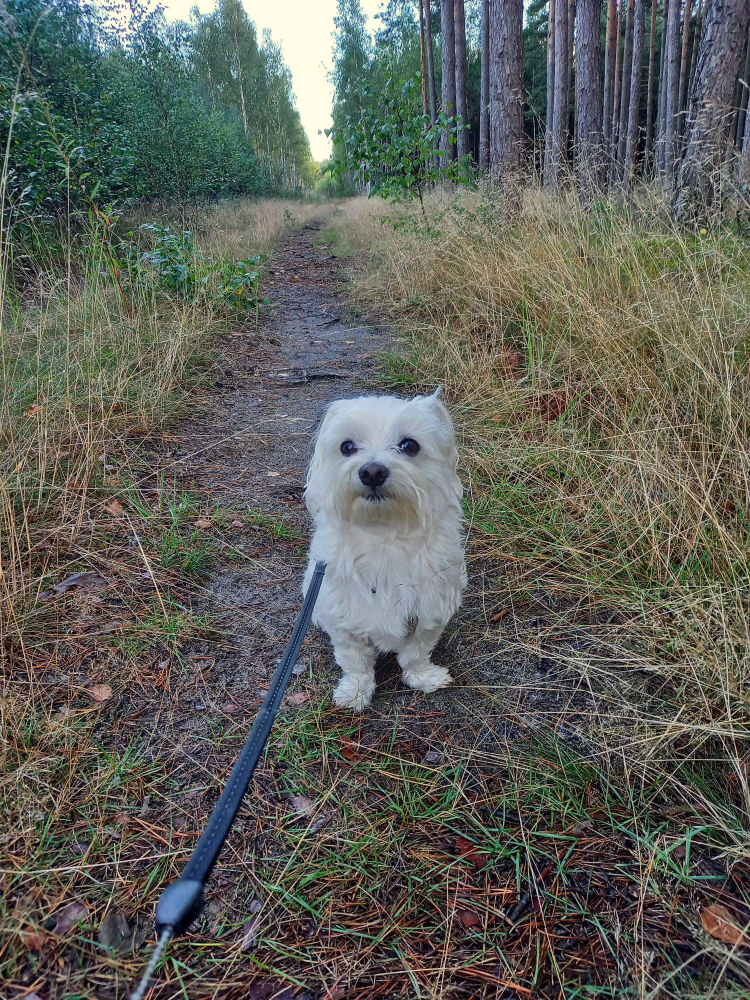
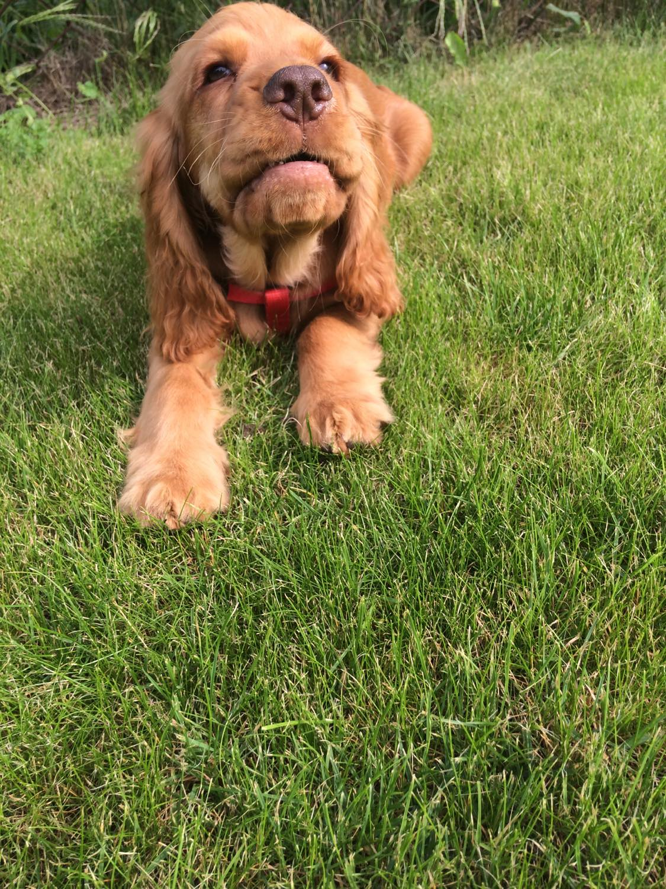
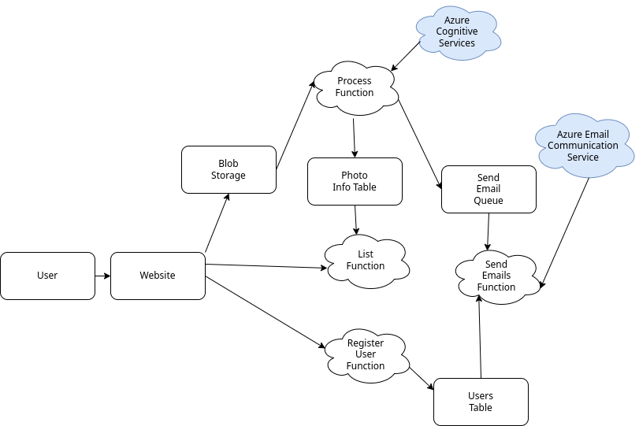

# Doggo Share

<p float="center">
  
  
</p>

Doggo Share is a cloud application that allows you to share your dog pictures with the world. It is built using Azure Functions, Azure Storage, Azure Cognitive Services and Azure Email Communication Service.
Register on the website using an email to receive all future dog photos. Upload your picture on the website and it will be automatically analyzed by Azure Cognitive Services to determine whether there is a dog in the picture or not. The picture will be stored in Azure Storage and if there is a dog in the picture, a link to the picture will be sent to all registered users. Additionally, on the website you can see all the pictures that were uploaded by other users along with the dog detection results and a link to the picture.
This is NOT a real application that is meant to be used by real users. It is just a university project which goal was to learn how to use Azure services.

## Project Initialization

### Login to Azure

```bash
az login
```

### Download dependencies

```bash
(cd ui; npm install)
```

```bash
(cd code; npm install)
```

### Initialize Terraform

```bash
(cd infra; terraform init)
```

## Deployment

### Create infrastructure

```bash
(cd infra; terraform apply)
```

### Get SAS token

```bash
(cd infra; terraform output -json)
```

### Replace SAS token in code ("sasToken" variable in "ui/index.js")

```bash
vim ui/index.js
```

### Build website

```bash
(cd ui; npm start)
```

### Upload website to Azure Storage

Go to doggosharecodesa storage account in Azure. Click on "Static website" and enable it. Set index document name to "index.html" and error document path to "index.html". Click "Save". Upload the files from "ui/dist" folder to $web container.

### Add Domain to "email-doggosharecommservice"

Currently it's not possible to achieve that via Terraform so it needs to be set up manually.
Go to "email-doggosharecommservice" resource in Azure.
Click on "Provision domains" and then on "1-click add".

### Connect email domain to "doggosharecommservice"

Go to "doggosharecommservice" resource in Azure.
Click on "Domains" and then on "Connect domain".
Select the domain that was added in the previous step and click "Connect".

### Update domain name in code/send_emails/index.js

Change the domain of senderEmail to the previously added domain.
For example if the domain name is "1234.azurecomm.net" then the senderEmail should be "DoNotReply@1234.azurecomm.net".

### Publish cloud functions

```bash
(cd code; func azure functionapp publish doggo-share)
```

## Architecture

<p float="center">
  
</p>
